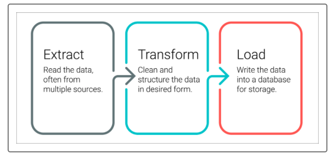
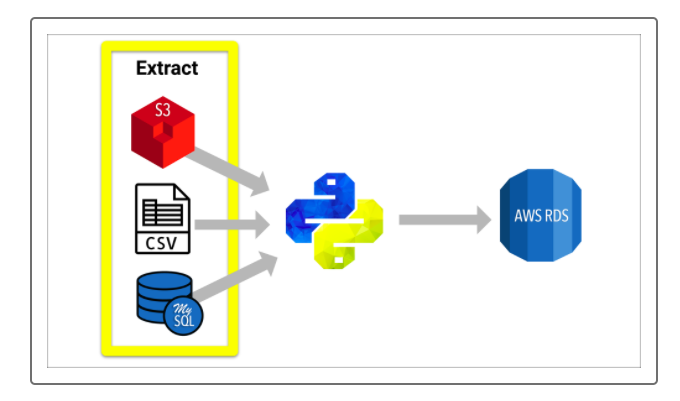
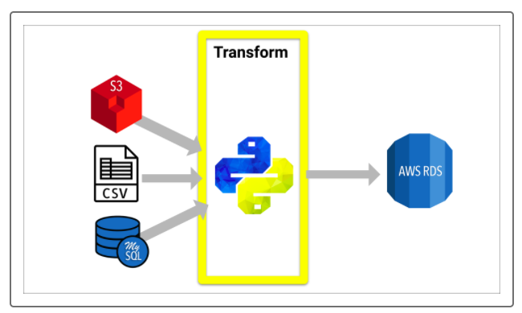
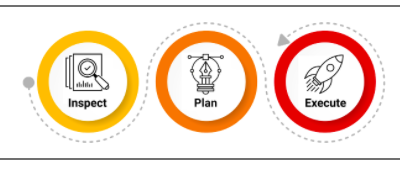
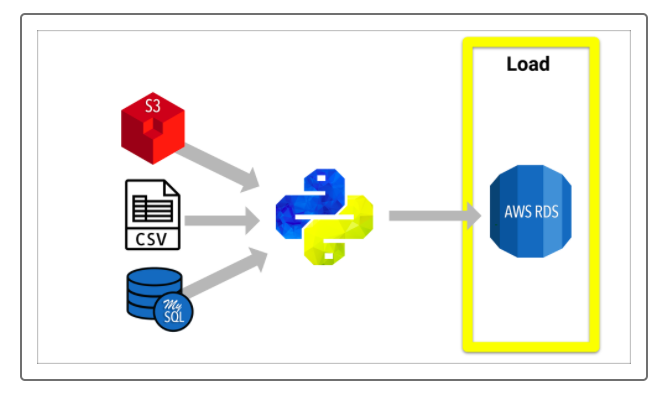

# Chrissy Cho's Movies-ETL
### Table of Contents
[ 1. Project Overview ](#desc)  
[ 2. Resources ](#resc)  
[ 3. Objectives ](#obj)  
[ 4. Summary ](#sum)  
[ 5. Challenge Overview ](#chal)  
[ 6. Challenge Summary ](#chalsum)  
[ 7. Challenge Assumption ](#assum) 

## Project Overview
In this module, we've learned to extract the Wikipedia and Kaggle data from their respective files, transform the datasets by cleaning them up and joining them together, and load the cleaned dataset into a SQL database. This is a process to create data pipeline. This process allows cleaning any messay data into good data before performing data analysis. In this project, we are using movie data from Wikipedia and Kaggle for their metadata and rating data. 

## Resources
- Data Source: [wikipedia.movies.json](https://github.com/chrissycho/Movies-ETL/blob/master/wikipedia.movies.json), [ratings.csv](https://github.com/chrissycho/Movies-ETL/blob/master/ratings.csv), [movies_metadata.csv](https://github.com/chrissycho/Movies-ETL/blob/master/ratings.csv)
- Software: [PostgreSQL version 12.3](https://www.enterprisedb.com/downloads/postgres-postgresql-downloads), [pgAdmin](https://www.postgresql.org/ftp/pgadmin/pgadmin4/v4.23/macos/), Python, Pandas

## Objectives
- Create an automated ETL pipeline
- Extract data from multiple resources using Juypter Notebook
- Clean and transform the data automatically using Pandas and regular expressions
- Load new data into PostgreSQL

## Summary
### ETL 
ETL is a process of extracting, transforming and loading data. 
 
 
During the Extract process, we will load data from mutiple sources into an interactive software (e.g., Jupyter Notebook). For this module, we extracted json data from Wikipedia and csv files from Kaggle. 

During the Transform process, we've followed an iterative process of insepction, planning, and executing to clean data. Once we extract data, we many need to filter, parse, sort, pivot, summarize, or merge datasets to have a consistent and clean data. When we handle a data source, we many perform multiple iterative process of inspection, planning, and executing codes. Before making any changes to data, we must examine the data type, missing values, duplicates or etc. 

Once we identify problems, we will then plan out how to fix the data. We can make decisions such as dropping the entire column or fill in zeros with missing values. Then, we can write codes to carry out our plans. 

## Challenge Overview
For this challenge, we will write a Python script that performs all three ETL steps on the Wikipedia and Kaggle data. We will leave out any code that performs exploratory data analysis, and we may need to add code to handle potentially unforeseen errors due to changes in the underlying data.

### Objectives
- Create an automated ETL pipeline.
- Extract data from multiple sources.
- Clean and transform the data automatically using Pandas and regular expressions.
- Load new data into PostgreSQL.

## Challenge Summary

## Challenge Assumptions
